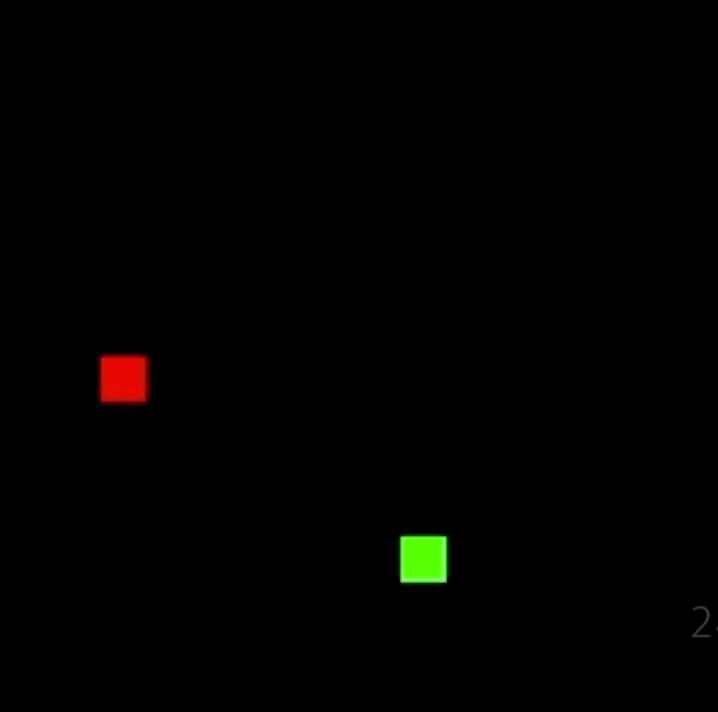

# DeepLearningSnakes


https://youtu.be/iFKVXohPn0s

## Requirements
- Python 3
- Tensorflow > 0.7
- pygame
- OpenCV-Python

## How to Run?
```
git clone https://github.com/jaehosung/DeepLearningSnakes.git
python deep_q_network.py
```

## References
 - https://github.com/yenchenlin/DeepLearningFlappyBird
 - https://www.pygame.org/project/857
 - https://hunkim.github.io/ml/
 
